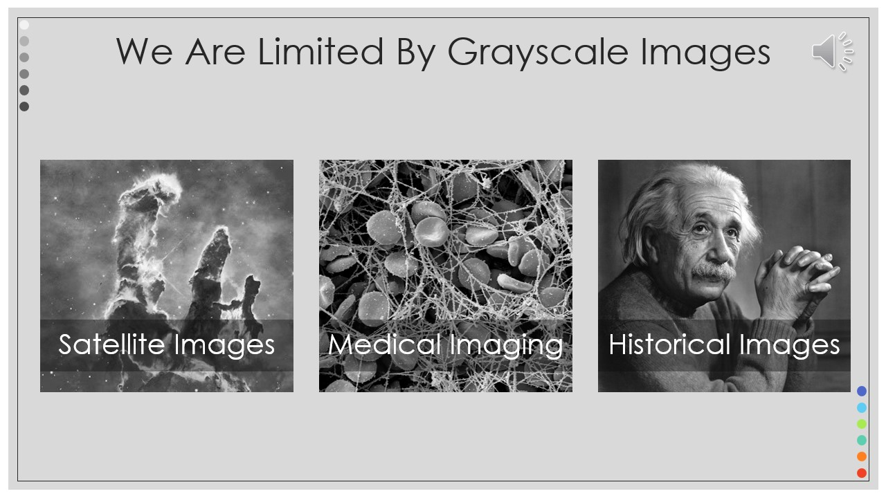
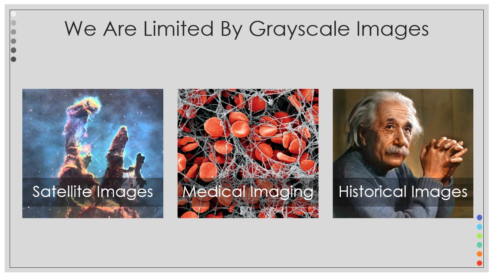
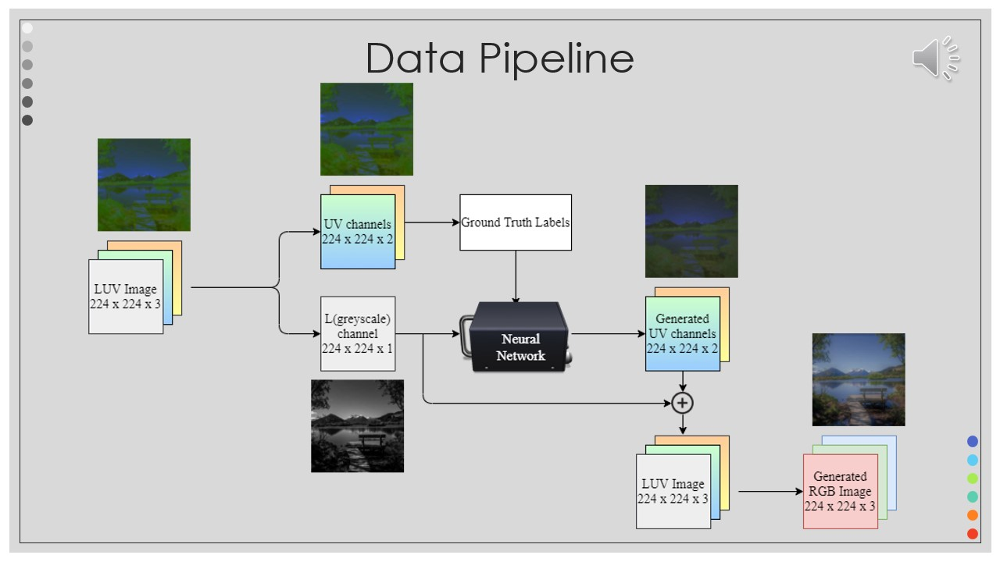
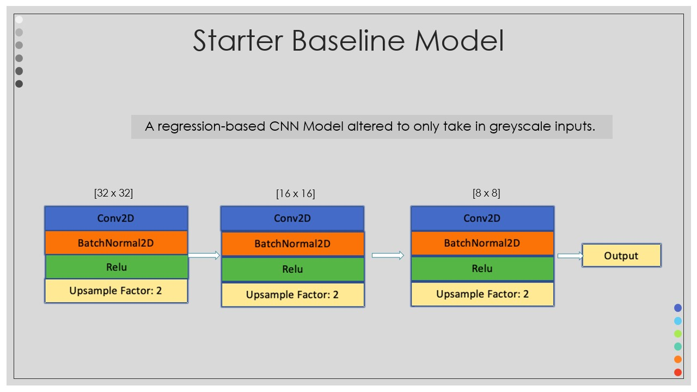
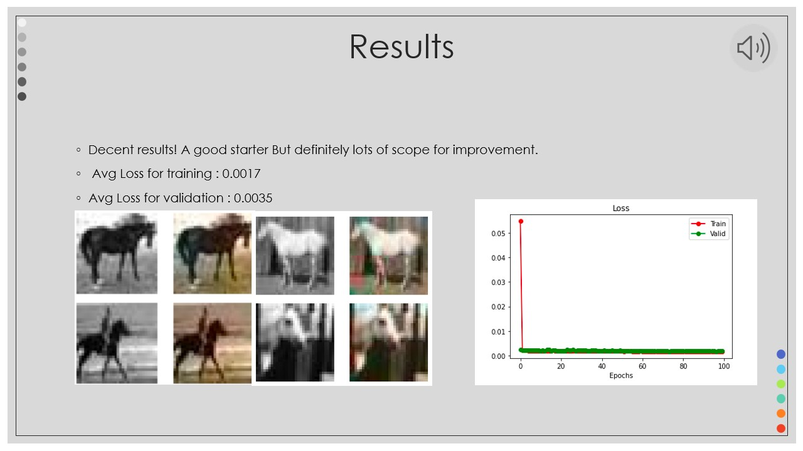
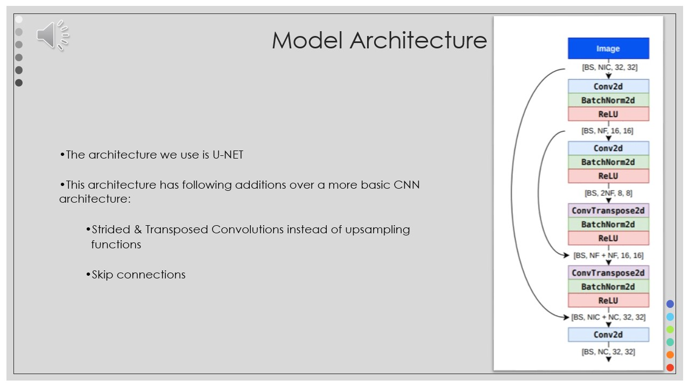
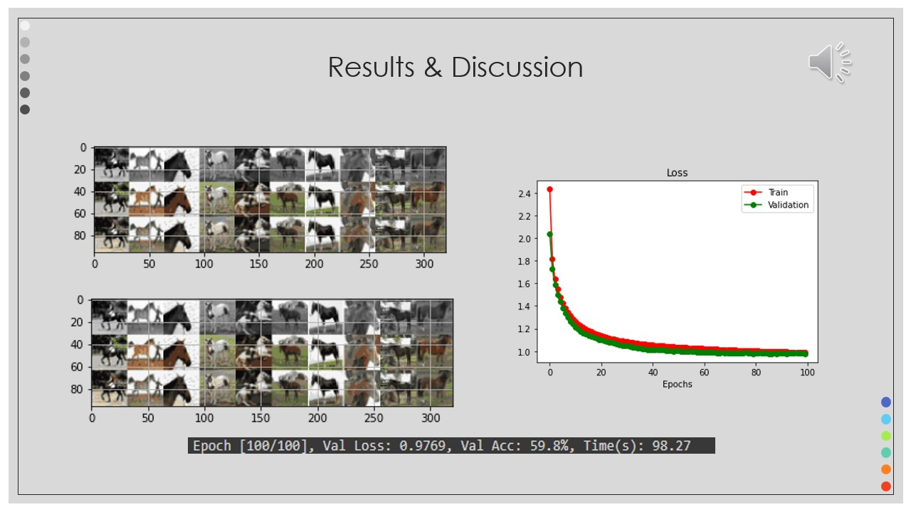
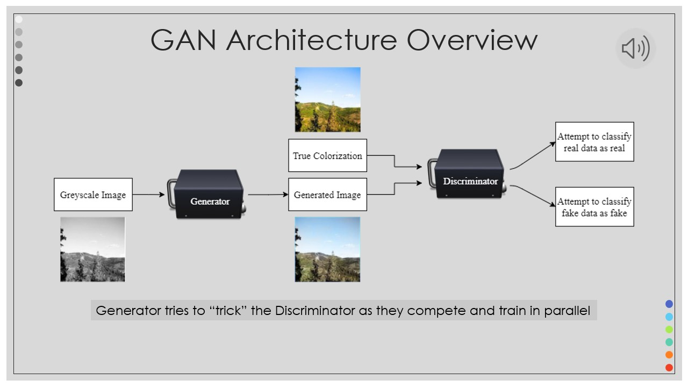
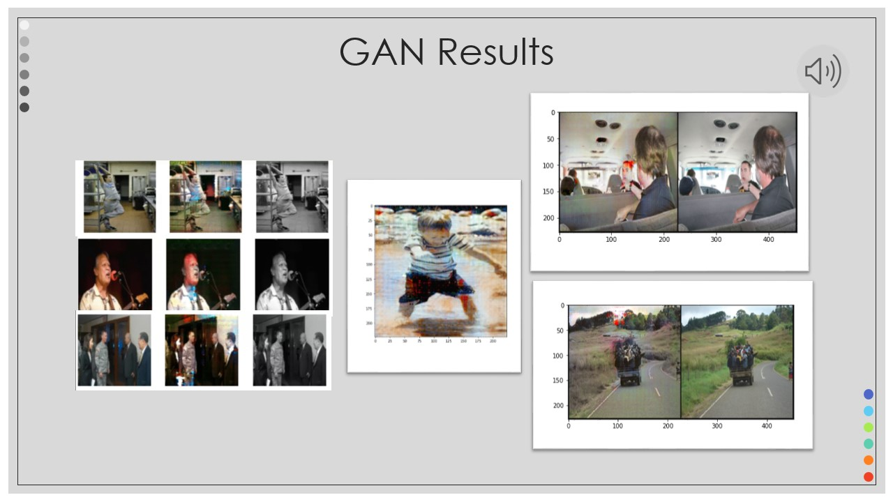

# NothingIsBlackOrWhite

A large part of historic and scientific research is affected due to grayscale images. Electron
microscopes and the Hubble telescope generate grayscale images, proving the variety of practical
applications for automatic colorization in the fields of nanotechnology, medicine, astronomy etc. Additionally, use cases exist in the colorization of historical images and films.The goal of
this project is to bring new life to these grayscale images by using neural networks to learn
colorization techniques from colored images. 

## Why Machine Learning (ML)?

This problem has no exact solution yet, because there is no deterministic relation between the grey image luminance and the chrominance values if it was a colored. Alternative solutions to ML can be categorized into Manual and Semiautomatic. Manual Coloring requires a large amount of skill, time and effort. Semiautomatic Coloring is easier but yields unsatisfactory results. Neither are practical with the advancements in science and technology so we will employ neural networks and artificial intelligence to efficiently colorize.

## Data Pipeline:

## Models:

### Baseline: Regression based

### Initial Model: Classification based

### Deoloyed Model: GAN based

## Deployment

https://user-images.githubusercontent.com/47704494/183753161-c5ac7e4e-ca90-43fd-a9e7-a05c64086156.mp4

